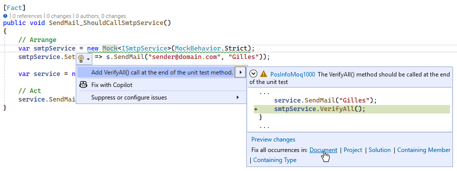

# PosInfoMoq1000: ``VerifyAll()` method should be called when instantiate a `Mock<T>` instances

| Property                            | Value                                                                                      |
|-------------------------------------|--------------------------------------------------------------------------------------------|
| **Rule ID**                         | PosInfoMoq1000                                                                             |
| **Title**                           | `VerifyAll()` methods should be called when instantiate a Mock<T> instances				   |
| **Category**                        | Design																				       |
| **Default severity**				  | Warning																				       |

## Cause

A `VerifyAll()` of an `Mock<T>` instance has not been called in the *Assert* phase
of an unit test.

## Rule description

When instantiating a `Mock<T>` in the *Arrange* phase of an unit test, `VerifyAll()` method
should be called in the *Assert* phase to check the setup methods has been called.

```csharp
[Fact]
public void SendMail_ShouldCallSmtpService()
{
	// Arrange
	var smtpService = new Mock<ISmtpService>();
	smtpService.Setup(s => s.SendMail("sender@domain.com", "Gilles"));

	var service = new CustomerService(smtpService.Object);

	// Act
	service.SendMail("Gilles");

	// Assert
	smtpService.VerifyAll();	// The VerifyAll() will check that the mocked ISmtpService.SendMail() has been called.
}
```

## How to fix violations

To fix a violation of this rule, call the `VerifyAll()` in the *Assert* phase
on the `Mock<T>` instances created during the *Arrange* phase.

### Visual Studio fixer
A Visual Studio fixer exists to add the call to the `VerifyAll()` method at the end of the unit test in the current document, project or solution.


## When to suppress warnings

Do not suppress a warning from this rule. Normally all setup methods must be call.
