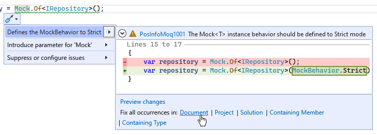

# PosInfoMoq1001: The mocked instances behavior should be defined to `Strict` mode

| Property                            | Value                                                            |
|-------------------------------------|------------------------------------------------------------------|
| **Rule ID**                         | PosInfoMoq1001                                                           |
| **Title**                           | The mocked instances behavior should be defined to `Strict` mode |
| **Category**                        | Design															 |
| **Default severity**				  | Warning															 |

## Cause

A mocked instance has been created with the `Loose` or `Default` behavior instead of `Strict`.

## Rule description

When instantiating a `Mock<T>` instance (or using the `Mock.Of<T>()` alternative), the `MockBehavior` of the `Mock` instance should be defined to `Strict`.

By default, [Moq](https://github.com/devlooped/moq) build instances of mocked instance which have a `Loose` behavior for non-setup methods.

For example with the following code:
```csharp
public interface IRepository
{
    int GetData();
}

public class CustomerService
{
	private readonly IRepository repository;

    public CustomerService(IRepository repository)
	{
		this.repository = repository;
	}

	public int GetDataFromRepository()
	{
		return this.repository.GetData();
	}
}
```

If a `Mock<T>` instance of `IRepository` is created with the `Loose` behavior (default behavior of [Moq](https://github.com/devlooped/moq)) and
the `GetData()` method has not been setup, the default `int` value (`0`) will be returned.

```csharp
[Fact]
public void GetDataFromRepository()
{
	// Arrange
	var repository = new Mock<IRepository>();		// Default behavior (Loose)

	//  /!\ No methods on the IRepository has been setup !
	
	var service = new CustomerService(repository.Object);

	// Act
	var result = service.GetDataFromRepository();	// "result" will be defined to 0.
}
```

To fix the violation of this rule for the previous example,
set the `MockBehavior` to `Strict` in the constructor of the `Mock<T>` class.

```csharp
[Fact]
public void GetDataFromRepository()
{
	// Arrange
	var repository = new Mock<IRepository>(MockBehavior.Strict);		// Strict behavior (Loose)

	//  /!\ No methods on the IRepository has been setup !
	
	var service = new CustomerService(repository.Object);

	// Act
	var result = service.GetDataFromRepository();	// A "MoqException" will be raised to indicate that the GetData() method has not been setup !
}
```

The same behavior should be defined if the `Mock.Of<T>()` alternative is used:
```csharp
[Fact]
public void GetDataFromRepository()
{
	// Arrange
	var repository = Mock.Of<IRepository>(MockBehavior.Strict);		// Strict behavior (Loose)

	//  /!\ No methods on the IRepository has been setup !
	
	var service = new CustomerService(repository);

	// Act
	var result = service.GetDataFromRepository();	// A "MoqException" will be raised to indicate that the GetData() method has not been setup !
}
```

## How to fix violations

To fix a violation of this rule, set the `MockBehavior` to `Strict` in the constructor of the `Mock<T>` class or as the last argument of `Mock.Of<T>()` method.

### Visual Studio fixer
A Visual Studio fixer exists to set explicitely the `MockBehavior` to `Strict` in the current document, project or solution.


## When to suppress warnings

Do not suppress a warning from this rule. Normally all methods called on a mocked instance must be setup.
